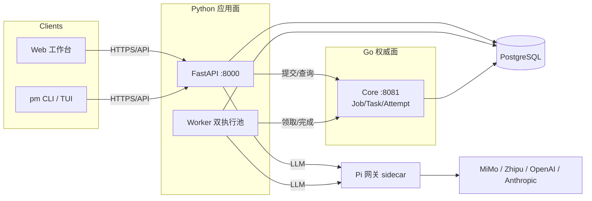

# PaperMind 2.0

**AI 驱动的个人研究终端 —— 从「管论文」进化为「懂领域」**

[](https://github.com/Color2333/PaperMind/releases/tag/v2.0.0)
[](https://go.dev)
[](https://python.org)
[](https://nodejs.org)
[](https://fastapi.tiangolo.com)
[](https://react.dev)
[](LICENSE)

> 2.0 全面重构：**Go 权威执行面 + Pi Agent 单网关 + 云端 CLI 终端**。
> 论文库不只是被检索——它被一个持久化、可审计、全天候的研究智能体持续消化。

🌐 **[在线发布页](https://color2333.github.io/PaperMind/)** · 📦 [1.x 历史文档](docs/README-1.x.md)

---

## ✨ 2.0 核心跃迁

### 1. Go 权威执行面
任务编排（Job / Task / Attempt）与领域写入全部收敛到 **Go 单事务权威面**：
21 项能力（skim / deep-read / embed / 摄取 / 引用同步…）经 manifest 路由，
fencing 令牌防脑裂，崩溃可恢复，死信可追溯。编排开销实测 **~10ms/任务**，
对比 LLM 秒级调用可忽略。

### 2. Pi Agent 单网关
所有 LLM 调用统一经 **Pi 网关**（OpenAI 兼容面，pi-ai 底座，Sidecar 容器部署）——
provider 换型零改码、配置热生效、令牌三容器同源。Agent 循环（1.1.0 内核）
同时驱动 Web 聊天与 CLI 终端。

### 3. 云端 CLI 终端（pm）
```bash
pm login --endpoint https://your-server/api   # 设备码授权，一次登录
pm                                            # 全屏 TUI——会话数据存云端，与网页同源
pm -p "库里最近有什么新论文？"                  # 一次性问答
pm papers search "world model"                # 确定性命令面（jobs/claims/export…）
```
CLI 零本地依赖（无需模型凭据）——agent 循环、工具、LLM 全在服务端，
换机器登录即续接。

### 4. 双执行池 + 闲时补偿
compute / orchestration 双执行池隔离长短任务；闲时自动补偿精读，
在途任务去重，PDF 不可用自动标记——**不重复计费，不无限重试**。

---

## 🏗️ 架构



- **Go Core**：权威任务存储 + 领域 apply 单事务（21 项能力 A 档）
- **Python**：纯计算 proposal + 编排器（submit → 在途去重 → 轮询）
- **Pi 网关**：LLM 单一出口（pi-ai 底座），配置热生效
- **pm CLI**：三形态终端 —— 云端全屏 TUI / 一次性问答 / 确定性命令面

## ⚡ 生产实测（真实运行数据）

| 指标 | 数值 |
|---|---|
| 任务编排开销 | submit 10.1ms · claim 3.8ms · **apply 单事务 6.5ms** |
| 深读单篇耗时 | 482.7s（视觉提取 + LLM，全链真实） |
| 库容规模 | 2,096 篇 · 近 7 天 +155 |
| 累计精读 | 995 篇成功（双 compute Runner 并行消化） |
| 测试 | 339 用例全绿 · Go build/vet/test 通过 |

## 🚀 快速开始

```bash
git clone https://github.com/Color2333/PaperMind.git && cd PaperMind
cp .env.example .env && $EDITOR .env        # 至少填一个 LLM API Key
docker compose up -d --build

# 🌐 前端    http://localhost:3002
# 📡 API    http://localhost:8002  · 文档 /docs
```

CLI（任何有 Node ≥ 18 的机器）：

```bash
npm install -g @papermind/cli    # 或使用 dist/papermind-cli-*.tgz
pm login --endpoint https://your-server/api
pm                               # 进入云端研究终端
```

## 📚 文档

- [1.x → 2.0 迁移说明](docs/README-1.x.md)
- [API 速览](docs/README-1.x.md#-api-速览)（兼容 1.x）
- 发布页：https://color2333.github.io/PaperMind/

## 🙏 致谢

- [pi](https://github.com/earendil-works/pi)（@earendil-works）—— Pi agent 内核与 pi-ai / pi-tui 底座

## 📄 License

MIT
